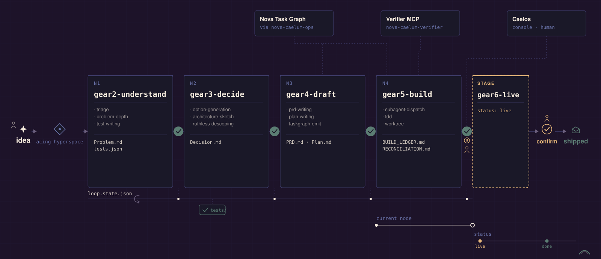

# Hyperspace Engine

**A five-node development loop that runs inside [Claude Code](https://claude.com/claude-code), with one-way evidence-bearing gates between the nodes.**

An agent cannot decide it is finished. That is the problem this solves.

Left alone, a coding agent will declare victory on a stub, mark work complete because it *looks* complete, and spend hours in a loop at the end of a build that it cannot detect it is in. The Hyperspace Engine replaces the agent's judgment about its own progress with a state machine and a set of gates that refuse on missing evidence.

<p align="center">
  
</p>

---

## What this repository is

This is a **field artifact, not a framework.**

It is the loop as it actually runs in one operator's system — published in the state it runs in, personalization included. The skills address a specific human by name, because they were shaped by that human's real failure modes across a month of sessions. That is deliberate. Sanding it into a generic "the user" would make it read like something designed in the abstract, and it wasn't: nearly every rule in here is scar tissue from a specific incident.

You are unlikely to clone this and run it. **It is published so the design is legible** — the loop, the gate contracts, and the state machine are all here to read, and the state machine runs and is tested.

---

## The loop

Five stations. Each is a skill, and each is the **only** door into its stage. **Four of them have gates** — the fifth is a stage, not a gated node: `gate-pass --node live` is refused outright (`CHECKS` in [`bin/node_gates.py`](bin/node_gates.py) registers `understanding`, `deciding`, `specifying`, `executing`, and nothing else).

| Node | Enters when | Exits with |
|---|---|---|
| `gear2-understand` | A goal nobody has framed | A frozen tests file — what "done" means, fixed *before* any building |
| `gear3-decide` | Tests frozen, design open | A frozen decision, every test mapped to a component |
| `gear4-draft` | Decision frozen, nothing filed | Rows filed on a task graph (its gate reads the backfilled `task_id`s in `Plan.md`, not the graph directly) |
| `gear5-build` | Rows filed, software owed | A documented reconciliation of every row |
| `gear6-live` | Build finished; a human's acceptance test is all that remains | The human's verdict — **no gate; this is a stage** |

`acing-hyperspace` is the sixth skill and the entry point: it runs at session start — cold, resumed, or compacted — and routes the work in front of the agent to the node it belongs in. A resumed session re-enters at the node its state file names, not wherever the conversation happens to be.

**Nothing is built in `gear6-live`.** The agent stops, announces the run is live, hands over the acceptance test that was designed at the very start, and watches. A clean pass with no troubleshooting is the highest grade available.

### Two properties worth understanding

**`current_node` and `status` are different axes, and this is the centre of the design.** Passing the Build gate sets `status: live` while leaving `current_node: executing` untouched. `confirm` then writes `escape_rate`, `status: done` and `final_route` — and does not touch `current_node` either.

So `current_node` never advances past `executing` at all. The node track goes flat while the status track keeps moving. That is what lets a build *end*: the agent reaches a state where it is no longer permitted to build, without ever having to judge that it is done. Only a human driver may call `confirm`.

**Gates are one-way and evidence-bearing.** A gate freezes its artifacts by sha256 and refuses when evidence is missing. The Build gate has four distinct exits:

| Exit | Meaning |
|---|---|
| `0` | Passed and frozen; `status` becomes `live` |
| `1` | Refused — a row is missing from the reconciliation, declared `done` when the verifier did not close it, or a check could not read its evidence file |
| `2` | Usage — an unregistered `--node`, or a required evidence flag not supplied |
| `3` | **HOLD** — an undischarged manual criterion on a row that is not the live test. The message names each row and quotes its criterion; that list is the agent's agenda with the human |

**HOLD is Build-only.** The `understanding`, `deciding` and `specifying` checks state explicitly that they have no hold path — they pass or they refuse.

A later re-hash of frozen artifacts that no longer match is recorded as a **double-back** — a quality signal on the run, not a gate failure.

The full status vocabulary is in [`bin/loop_terminal.py`](bin/loop_terminal.py):

```
framing · understanding · deciding · specifying · executing · verifying
live · done · descoped · killed · abandoned_budget · blocked_external
```

`framing` is the real init state that `gear2-understand` is entered *from*. `verifying` is in the vocabulary with no registered check — it is unused, and left in rather than quietly removed.

---

## Dependencies — read this before assuming it runs

The engine has a **hard dependency on two systems that are not in this repository**, and both are proprietary to Nova Caelum.

### 1. The Nova Task Graph

`gear4-draft` files work items onto a task graph, and `gear5-build`'s exit gate reconciles against it. That graph is a Supabase-backed schema fronted by a private MCP server (`nova-caelum-ops`). Every row carries typed acceptance criteria, and the Build gate reads each row's disposition and closure identity from it.

Without the task graph, `gear4-draft` has nowhere to file and `gear5-build`'s gate has nothing to reconcile.

### 2. Caelos

[Caelos](https://github.com/Nova-Caelum/Caelos) is the console and command centre for the same system — the human-facing surface where rows are read and closed by hand. It matters to the engine specifically because **a row closed in Caelos is a distinct closure path** from one closed by the verifier, and the Build gate treats them differently: a human's deliberate closure passes, because the human *is* the discharge of a manual criterion.

That distinction is enforced by a `completed_by` role label written server-side at whichever door closed the row. The gate accepts two labels as evidence of a legitimate closure and refuses a third by name (a batch plan-ingest door that checks identity but verifies nothing).

### 3. The verifier (included here as reference only)

[`reference/verifier_server.py`](reference/verifier_server.py) is the MCP server that closes a task-graph row on evidence. It verifies a completion claim against the real checkouts on disk in five steps — vet, criteria quality, landing check, evidence judge, commit — and returns exactly one of `done`, `refused`, `unverifiable`, or `already_done`. Never a receipt, never a promise.

The landing check is the interesting part: **evidence is a delta.** A criterion that was already satisfied before the work started does not discharge it, ever.

It is included because the gate's contract is unreadable without it. **It will not run from this repository** — it is a 117-line shim over a `primitives.completion` package that lives in a separate private repo. Read it as an interface, not as software you can start.

---

## What actually runs here

| | |
|---|---|
| `bin/` | The engine. `loop_state.py` (state machine + CLI), `node_gates.py` (the exit checks), `loop_terminal.py` (status vocabulary), `plan_lint.py`, and the state JSON schema |
| `tests/` | **Runnable.** `python3 -m pytest tests/ -q` → **20 passed**, stdlib only, no configuration |
| `skills/` | The six skills, verbatim, including the demi-skills behind each node |
| `reference/` | Not runnable standalone. The verifier MCP shim, and `test_node_gates.py` — 2,881 lines covering every gate branch, which needs the vault's fixture harness (`loader`, `assertions`, `plan_lint` fixtures) to execute |
| `docs/` | The diagram |

You will find **dangling references** throughout the skills — anchor docs, incident files, and prior artifacts (`AgentSecretBase/_wiki/incidents/…`) that live in a private vault and are not here. They are left in deliberately. Each one is a load-bearing citation showing *why* a rule exists, and stripping them would hide the fact that every rule in this loop has a source.

The one adaptation made during extraction: the tests locate `bin/` by relative depth, which differs outside the vault, so a `conftest.py` resolves it from the repository root instead. Absolute host paths in the skills were templated to `$AGENTOS_ROOT`. Nothing else was altered — the skills are byte-for-byte what runs.

```bash
python3 -m pytest tests/ -q
```

---

## Design notes

**Skills, not prompts.** Each node is a directory with a `SKILL.md` and, behind it, demi-skills that are not independently invocable. The node is the only door; the demi documents are steps, not entrances. This exists because an agent handed eleven flat skills will reach for the wrong one, or none.

**The gate moved earlier on purpose.** An earlier design held the Build gate until every criterion was discharged, including manual ones only a human can supply. The result was a finished build that still looked like building — in the operator's words, *"the cancer we have been facing."* The gate now confers `live` as soon as the work is built, wired, promoted and deployed, and the human's test becomes its own stage.

**Manual criteria hold the gate, and that reversed a decision.** The first version let manual criteria defer to the live stage. That was reversed, and the reasoning is worth quoting because it inverts the usual framing:

> *"If a criterion requires manual verification, and that row is left unclosed, that is a failure on the agent to not adequately direct me that they had completed work that was ready to be reviewed."*

An unreviewed row is not a blocked row. It is the agent failing to ask.

---

## Status

The loop is live in daily use. Its own final acceptance test — a human driving a real goal through all four stages from the session-start primer alone, without opening a skill file to learn the next step — **has not yet run.** When it does, the result will be recorded here whichever way it goes.

Building in public means publishing the gate that has not yet been passed.

---

## Related

- **[Caelos](https://github.com/Nova-Caelum/Caelos)** — the console this engine reports into
- **[no-mistakes](https://github.com/Nova-Caelum/no-mistakes)** — three skills that stop an agent substituting a real result with a plausible one
- **[fresh-eyes](https://github.com/Nova-Caelum/fresh-eyes)** — a reviewer with no memory of you and no history with your system

## License

MIT — see [LICENSE](LICENSE).

`acing-hyperspace` derives from the `using-superpowers` pattern in [obra/superpowers](https://github.com/obra/superpowers) (MIT); `gear5-build`'s worktree demi-skill derives from that project's `using-git-worktrees`. Both are noted in the skills' own frontmatter.
