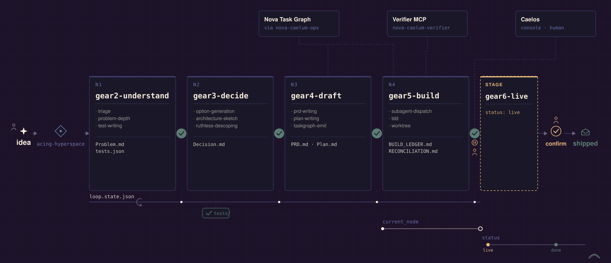

# Hyperspace Engine

[](https://github.com/Nova-Caelum/hyperspace-engine/actions/workflows/ci.yml)

**A development loop for [Claude Code](https://claude.com/claude-code) where the agent cannot decide it
is finished.**

Left alone, a coding agent declares victory on a stub, marks work complete because it *looks*
complete, and spends an hour at the end of a build in a loop it cannot see. Hyperspace Engine takes
that judgment away from it. Work moves through five stations separated by gates that refuse on missing
evidence, every task closes only when an independent verifier sees the change on disk, and the last
step — calling it done — belongs to you.

It installs as a Claude Code plugin and runs entirely on your machine: a local SQLite task graph, a
local verifier, and a task-graph console in your browser at `localhost`. No accounts, no servers, no
Nova Caelum service.

<p align="center">
  
</p>

---

## Try it in five minutes

**You need:** Claude Code, and Python 3.11 or newer — or [`uv`](https://docs.astral.sh/uv/), which
setup can use in place of a system Python and which builds the environment faster either way.

- **macOS / Linux:** Python 3.11+ as `python3`, or `uv`.
- **Windows 11:** Python 3.11+ from [python.org](https://www.python.org/downloads/windows/) (it adds
  the `py` launcher), or `uv`; and [Git for Windows](https://git-scm.com/downloads/win) — Claude Code
  runs this plugin's session hook through Git Bash.

**1. Install the plugin** in the project you want to use it in:

```bash
claude plugin marketplace add Nova-Caelum/hyperspace-engine
```

```bash
claude plugin install hyperspace-engine@hyperspace-engine --scope project
```

(Inside a session, `/plugin` does the same.)

**2. Set it up.** Start `claude` in that project and say **"set up hyperspace"**. The setup skill
checks your Python, builds an isolated environment in `.hyperspace/env`, creates the task graph at
`.hyperspace/graph.db`, asks which judge to use, opens the console at `http://127.0.0.1:8791`, and
writes a double-click launcher so you can reopen it later. Restart the session when it tells you to,
so the plugin's MCP server connects to the new environment.

**3. Give it a goal.** Say what you want built — *"add a file named hello.txt containing hello"* is
enough to see the whole path. The loop frames it, writes down what "done" means before building,
files the work as rows in the task graph, builds it, and closes each row through the verifier.

**4. Watch it close.** In the console, the row moves to **done** — stamped by the verifier, not by
the agent.

If anything looks wrong, run `.hyperspace/env/bin/hyperspace doctor` from the project folder (the
same command on every OS, PowerShell included): one `OK` / `FAIL` line per check (Python,
environment, store, judge, console port).

---

## What you get

| Piece | What it does |
|---|---|
| **The loop** | Five stations — understand, decide, draft, build, live — each entered through one skill. `acing-hyperspace` routes every session, cold or resumed, to the station its run is in. |
| **Gates** | Four one-way exit checks. They read evidence, freeze it by sha256, and refuse with every cause listed when something is missing. They have no opinion about quality. |
| **A local task graph** | One SQLite file with projects, modules, work items and an append-only record of every filing. Your agent reads and writes it through the plugin's MCP server, `hyperspace`. |
| **A closure verifier** | `complete_workitem` checks a claim against the files on disk in five steps and returns exactly `done`, `refused`, `unverifiable` or `already_done`. Evidence is a delta: something already true before the work started never counts. |
| **The console** | The task graph in your browser, served on `127.0.0.1` only. |
| **Setup and doctor** | One conversational setup, a launcher for your platform, and a health check. |

---

## How the loop works

| Station | Enters when | Leaves with |
|---|---|---|
| `gear2-understand` | A goal nobody has framed | A frozen tests file — what "done" means, fixed before anything is built |
| `gear3-decide` | Tests frozen, design open | A frozen decision, every test mapped to a component |
| `gear4-draft` | Decision frozen, nothing filed | A PRD, a plan, and every task filed as a row in the task graph |
| `gear5-build` | Rows filed, software owed | Every row built and closed by the verifier, or openly deferred |
| `gear6-live` | The Build gate has passed | Your verdict on the acceptance test written at the first station |

Passing the Build gate sets the run's status to `live`: built, and waiting for you. Only a human can
move it to `done`. There is no command an agent can run to promote its own work to finished — that
missing capability is the design.

The full explanation starts at [`docs/00_start_here.md`](docs/00_start_here.md).

---

## Choosing a judge

The verifier's deterministic checks (a file exists or contains a string, a command exits 0) run
without any model. Two optional steps — "are these criteria about this task?" and "does the change
establish them?" — use a judge you choose at setup. You can change it later in
`.hyperspace/config.toml`.

| Judge | Uses | Needs |
|---|---|---|
| `none` | No model. Deterministic criteria close; semantic review is skipped. | Nothing — always works |
| `claude-code` | Your Claude Code login, through `claude -p` | The `claude` CLI, logged in |
| `codex` | The Codex CLI | The `codex` CLI |
| `anthropic` | The Anthropic API | `ANTHROPIC_API_KEY` in your environment |
| `openrouter` | OpenRouter | `OPENROUTER_API_KEY` in your environment |

Setup never asks for a key's value; it tells you which environment variable to set. The trade-offs
between judges are in [`docs/05_design_rationale.md`](docs/05_design_rationale.md).

---

## Platform support

| Platform | v1.0.0 |
|---|---|
| macOS | Verified end to end: public-marketplace install through a verifier-closed row read back from the console |
| Linux | CI: the full test suite, real provisioning, the MCP server, and the real `claude` binary starting it and running the session hook |
| Windows 11 | CI (Windows Server runner): the same set as Linux, plus the launcher and every command form the skills use in Git Bash, PowerShell and cmd. Needs Git for Windows. The interactive path on a real Windows 11 PC is the remaining proof |

---

## Building on it

Another Claude Code plugin can depend on this one. In its `.claude-plugin/plugin.json`:

```json
"dependencies": [
  { "name": "hyperspace-engine", "marketplace": "hyperspace-engine", "version": "^1.0" }
]
```

and in that plugin's own `marketplace.json`, allow the cross-marketplace dependency:

```json
"allowCrossMarketplaceDependenciesOn": ["hyperspace-engine"]
```

Claude Code resolves the range against this repository's `hyperspace-engine--v<version>` tags.

---

## Documentation

| Read | For |
|---|---|
| [`docs/00_start_here.md`](docs/00_start_here.md) | The five-minute model and two reading paths — one for you, one for your agent |
| [`docs/01_introduction.md`](docs/01_introduction.md) | Every concept and term, with a glossary |
| [`docs/02_the_loop_and_gates.md`](docs/02_the_loop_and_gates.md) | Each station, what it produces, what its gate checks |
| [`docs/03_architecture.md`](docs/03_architecture.md) | What is where, and how a row travels from filing to done |
| [`docs/04_skills_and_actions.md`](docs/04_skills_and_actions.md) | Every skill and command, split into what you need to know and what the agent needs to know |
| [`docs/05_design_rationale.md`](docs/05_design_rationale.md) | Why it is shaped this way, and the choices you make |
| [`docs/06_adaptation_notes.md`](docs/06_adaptation_notes.md) | How the standalone plugin differs from the engine it came from |
| [`docs/07_troubleshooting.md`](docs/07_troubleshooting.md) | Keyed by the message you saw |
| [`docs/08_worked_run.md`](docs/08_worked_run.md) | One complete run, start to finish |
| [`docs/09_future_states.md`](docs/09_future_states.md) | Where it goes next |
| [`docs/reference/`](docs/reference/) | Commands, state fields, gate contracts, statuses and MCP tools — generated from source and checked in CI |

---

## Development

```bash
uv venv && uv pip install -e ".[dev]"
uv run python -m pytest tests/ -q
```

The same two commands work on macOS, Linux and Windows. The suite runs on all three in CI. CI also validates the plugin manifest in strict mode, runs the scan probes
that keep the shipped tree free of private paths and names, and checks that the console bundle
rebuilds byte for byte from its pinned source. Agents working in this repository should read
[`.claude/CLAUDE.md`](.claude/CLAUDE.md) first.

---

## Want more?

Hyperspace Engine is the loop Nova Caelum builds with every day, released so you can install it and
try it yourself. If you want help putting it to work in your team, or want what sits around it, get
in touch at [novacaelum.com](https://novacaelum.com).

**Related:**
[Caelos](https://github.com/Nova-Caelum/Caelos) — the console this plugin ships ·
[no-mistakes](https://github.com/Nova-Caelum/no-mistakes) — three skills that stop an agent
substituting a plausible result for a real one ·
[fresh-eyes](https://github.com/Nova-Caelum/fresh-eyes) — a reviewer with no memory of you and no
history with your system

---

## License

MIT — see [LICENSE](LICENSE). Third-party provenance is in
[THIRD_PARTY_NOTICES.md](THIRD_PARTY_NOTICES.md).

`acing-hyperspace` derives from the `using-superpowers` pattern in
[obra/superpowers](https://github.com/obra/superpowers) (MIT); `gear5-build`'s worktree demi-skill
derives from that project's `using-git-worktrees`. Both are noted in the skills' own frontmatter.
